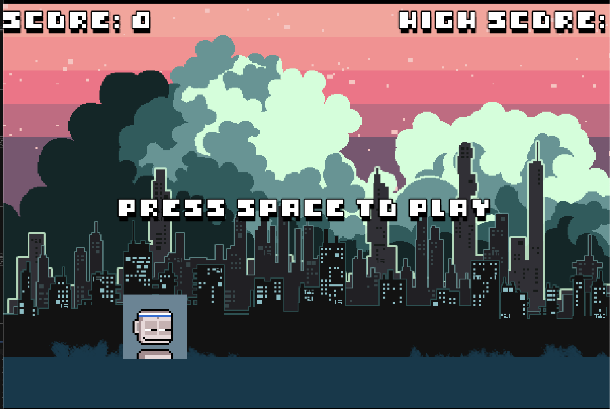
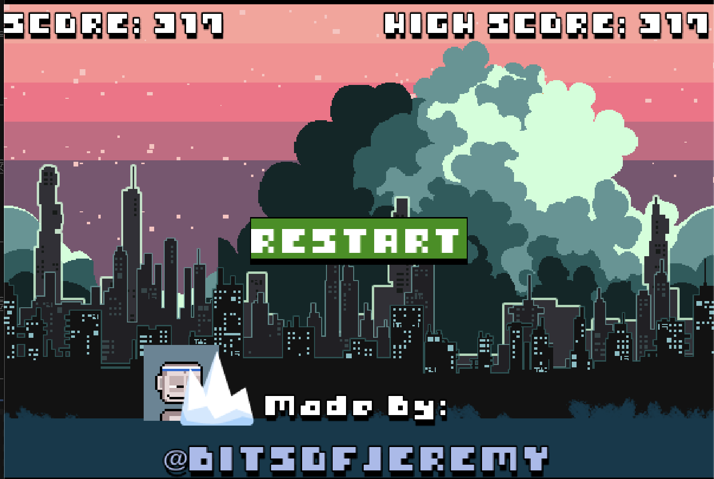

# papp_runner

Simple 2D runner game with PAPP NFTs

https://youtu.be/MUYXWCKm4gU

# Play Online

On my Itch.io page:

https://bitsofjeremy.itch.io/papp-runner

# Make it PAPP!

- Press SPACE to start
- Jump the obstacles
- Furthest run gets high score

## Resources Used

`8bit_jump.wav` - taken from Bracky
`iNFERNO - 3DSOM Pro  [Keygen Music].mp3` - Don't remember where I found this.

`whole_128x128.png` - My PunkApepen #9432

`object_iceberg.png` - From [Game Art Guppy](https://www.gameartguppy.com/shop/ice-world-platformer-set/)

`far_city_background` - From [Lucky Loops Itch page](https://lucky-loops.itch.io/parallax-city-background)

`bitbybit_ [Font].ttf` - From [Analog Studios](https://analogstudios.itch.io/bitbybitfont)

Code and inspiration for the runner type game provided by:

https://www.youtube.com/@CodingWithRuss

<iframe width="560" height="315" src="https://www.youtube.com/embed/nKBhz6oJYsc?si=DLF3SFdk6aQC7CQ6" title="YouTube video player" frameborder="0" allow="accelerometer; autoplay; clipboard-write; encrypted-media; gyroscope; picture-in-picture; web-share" referrerpolicy="strict-origin-when-cross-origin" allowfullscreen></iframe>

